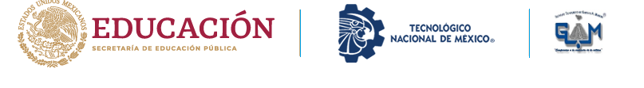

# DEsarrollo web SSR - 2026A

Repositorio de la Materia de DEsarrollo We SSR (Server Side Rendering)
s
# Contenido

- Ramas de Contenido
- Proyecto eje de la materia

# 🎯sObjetivos

Documentar los aprints del proyecto que se desarrollara a lo largo del curso

# Ramas del proyecto

- 'dev' rama de desarrollo
- 'main' ramaprincipal

# Conveciones de Comits

|Codigo|Descripcion|
|-----------|-------------|
|feat: ⭐|Nueva funcionalidad|
|fix: 🐍 |Correcion de errores|
|docs: 📄|Cambios en la documentacion|
|style:🎨|Cambio de acpecto visual
|refactor:♻️|Refactorizacion de codigo|
|perf:⚡  |mejoras de rendimiento|
|test:✅ |Cambios en los test|
|chore:🦴|Cambios  en dependencias|
|ci: 🤖  |Cambios en el CI/CD|
|revert:🐟|Reveresion de comits|

**Ejemplos:**

> feat : agrega autorizacion de usaurios

# 👤 Autor

[De Jesus Sierra Angel Misael]